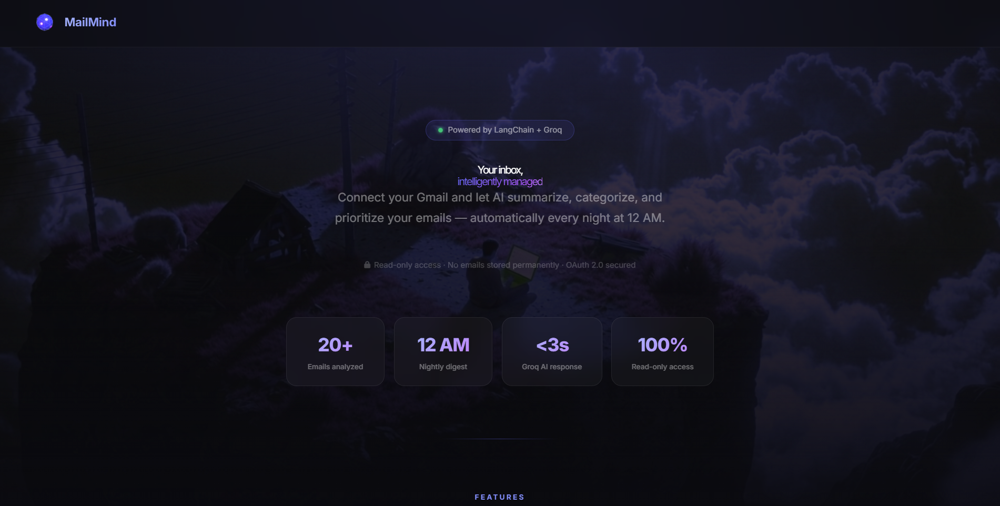
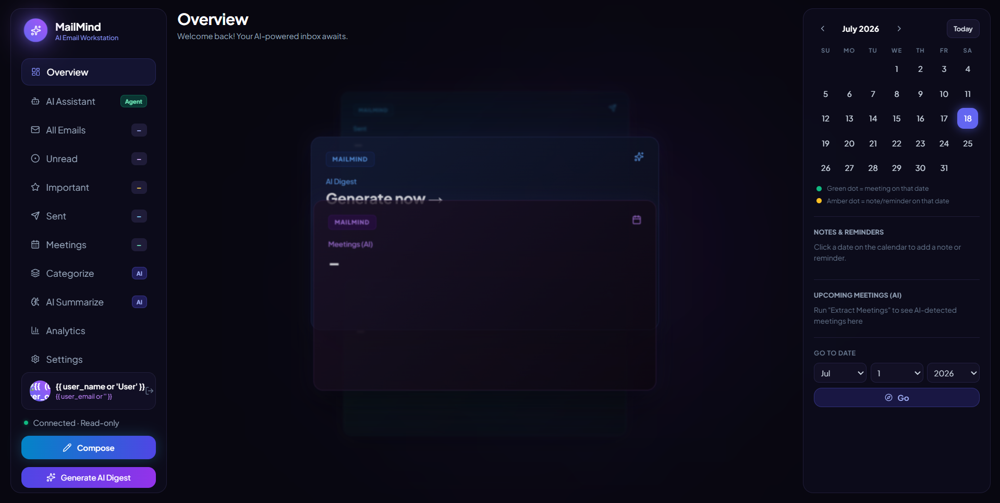
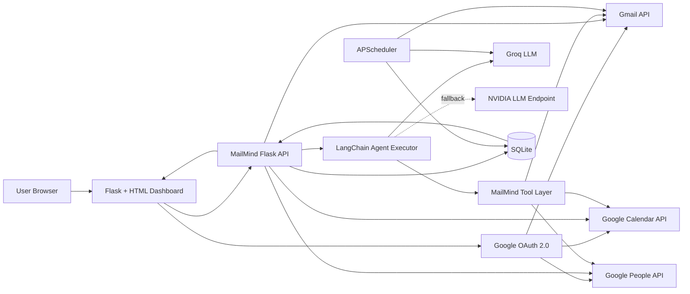
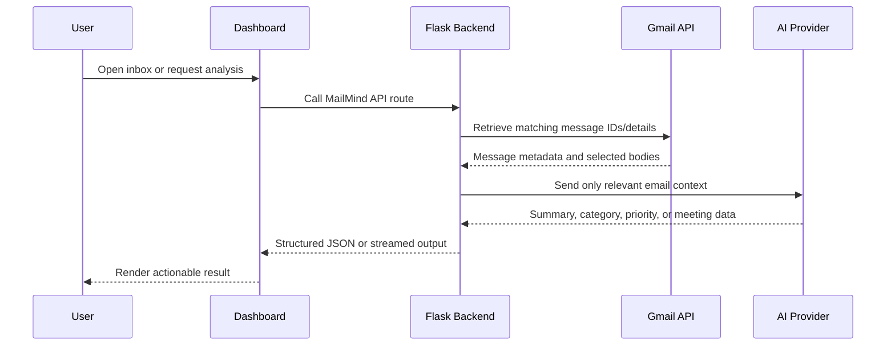
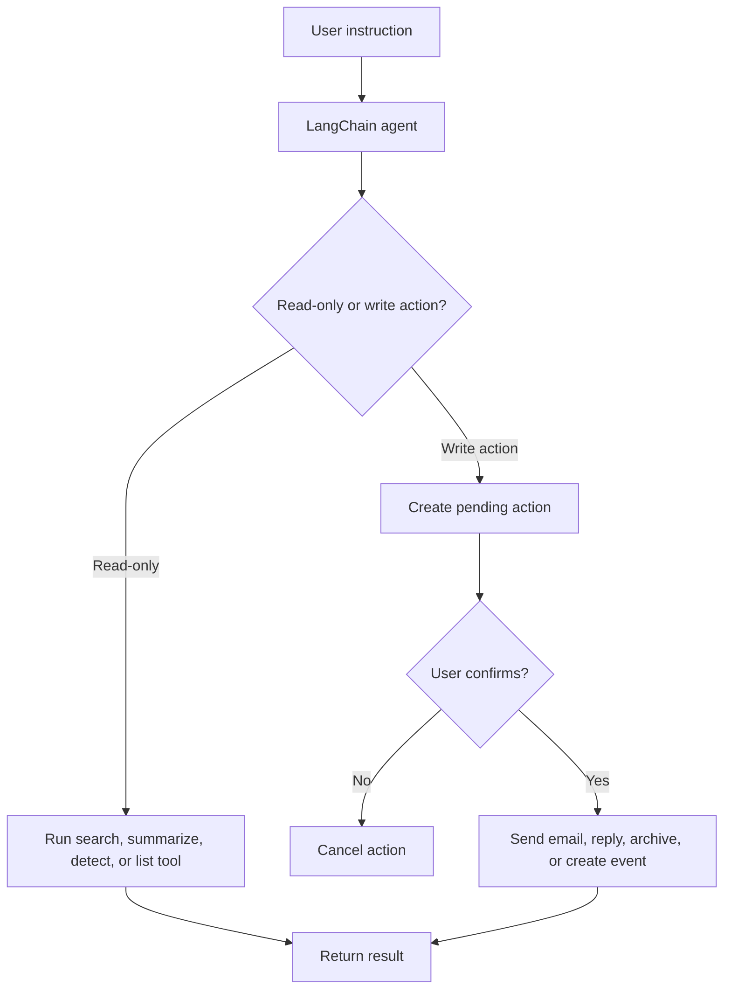
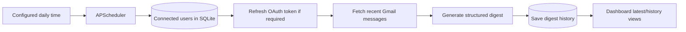

<div align="center">

# MailMind

### AI-powered Gmail workspace for understanding, prioritizing, summarizing, searching, and acting on email

[](https://www.python.org/)
[](https://flask.palletsprojects.com/)
[](https://python.langchain.com/)
[](https://developers.google.com/gmail/api)
[](LICENSE)

**MailMind turns a crowded Gmail inbox into an AI-assisted workspace.** It connects through Google OAuth, retrieves Gmail data, identifies important messages, extracts meetings, categorizes mail, creates digests, searches the inbox, drafts replies, sends email after confirmation, and can create Google Calendar events.

[Features](#features) · [Architecture](#architecture) · [Workflow](#workflow) · [Setup](#local-setup) · [Screenshots](#screenshots) · [Security](#security-and-privacy)

</div>

---

## Overview

Email is not difficult because messages are unavailable; it is difficult because the important information is buried across hundreds or thousands of messages.

MailMind provides one interface for:

- reading recent, unread, important, and sent email;
- finding messages with Gmail-backed search;
- generating concise AI summaries and daily digests;
- detecting deadlines, interviews, meetings, and action items;
- categorizing messages and assigning priority;
- chatting with an agent that selects the correct email or calendar tool;
- composing and replying to email with explicit user confirmation;
- creating Google Calendar events and Google Meet links.

> MailMind does **not** need to display the entire mailbox at once. Gmail data should be fetched and presented in batches while search and background indexing provide access across the mailbox.

---

## Screenshots

### Landing page



### Dashboard



The screenshots show the current MailMind landing page and AI email dashboard. Dynamic Gmail data appears after a Google account is connected and the backend APIs return live results.

---

## Features

| Area | Capability |
|---|---|
| Gmail connection | Google OAuth 2.0 login with progressively requested permissions |
| Inbox dashboard | Recent, unread, important, sent, meetings, categories, digest, and analytics views |
| AI assistant | LangChain tool-calling agent for natural-language email and calendar tasks |
| Important mail | AI detects high-value messages such as interviews, deadlines, approvals, and security alerts |
| Meeting extraction | Finds dates, times, links, and meeting context from messages |
| Smart categorization | Groups email into useful categories and applies high, medium, or low priority |
| Summarization | Streams an AI-generated digest to the dashboard |
| Automatic digest | APScheduler generates and stores a digest for connected users at a configurable time |
| Gmail search | Uses Gmail search syntax for mailbox-level retrieval |
| Compose and reply | Generates and sends messages after the required Gmail permission is granted |
| Calendar actions | Creates Google Calendar events and Google Meet links |
| Contact resolution | Uses Google People API when contacts permission is available, with Gmail-header fallback |
| Persistent state | SQLite stores connected-user OAuth data and generated digest history |
| LLM fallback | Groq is primary; NVIDIA-hosted OpenAI-compatible inference can act as fallback |
| Action safety | Agent write actions use pending-action confirmation before execution |

---

## Architecture



### Main components

| Component | Responsibility |
|---|---|
| `templates/index.html` | Landing page and Google connection entry point |
| `templates/dashboard.html` | Interactive email, assistant, digest, meeting, calendar, and analytics UI |
| `app.py` | Flask routes, OAuth, Gmail/Calendar/People integrations, LLM calls, agent tools, scheduler, and SQLite access |
| Google OAuth | Grants only the permissions needed for the selected feature tier |
| Gmail API | Reads, searches, replies, composes, sends, archives, and counts matching messages |
| Google Calendar API | Lists, creates, and updates calendar events |
| Google People API | Resolves contact names to saved email addresses |
| LangChain | Selects tools and coordinates agent execution |
| Groq/NVIDIA | Performs classification, extraction, summarization, and agent reasoning |
| SQLite | Stores user OAuth credentials and digest history |
| APScheduler | Runs the configurable automatic digest job |

---

## Workflow

### Read and analyse workflow



### Agent action workflow



### Automatic digest workflow



---

## Tech stack

### Backend

- Python 3.13 recommended for the current pinned LangChain stack
- Flask
- SQLite
- APScheduler
- Requests
- python-dotenv

### AI and orchestration

- LangChain
- LangChain Core
- LangChain Groq
- LangChain OpenAI-compatible client
- Groq chat-completions API
- NVIDIA OpenAI-compatible inference endpoint as fallback

### Google integrations

- Gmail API
- Google Calendar API
- Google People API
- Google OAuth 2.0
- `google-api-python-client`
- `google-auth`, `google-auth-oauthlib`, and `google-auth-httplib2`

### Frontend

- HTML5
- Tailwind CSS via CDN
- Vanilla JavaScript
- Lucide icons
- Fuse.js
- Server-Sent Events-style streamed digest response

---

## Project structure

```text
MailMind/
├── app.py
├── README.md
├── requirements.txt
├── .gitignore
├── .env.example
├── credentials.json          # Local only; never commit
├── mailmind.db               # Generated locally; never commit
├── docs/
│   └── screenshots/
│       ├── index.png
│       └── dashboard.png
└── templates/
    ├── index.html
    └── dashboard.html
```

---

## Local setup

### Prerequisites

- Python 3.13 recommended
- A Google Cloud project
- Gmail API enabled
- Google Calendar API enabled for meeting creation
- Google People API enabled for contact lookup
- A Groq API key, or an NVIDIA API key for the fallback provider

### 1. Clone the repository

```bash
git clone https://github.com/aavikshit2007-ops/MailMind.git
cd MailMind
```

### 2. Create a virtual environment

#### Windows PowerShell

```powershell
py -3.13 -m venv .venv
.\.venv\Scripts\Activate.ps1
```

#### Git Bash on Windows

```bash
py -3.13 -m venv .venv
source .venv/Scripts/activate
```

#### macOS/Linux

```bash
python3 -m venv .venv
source .venv/bin/activate
```

Confirm the interpreter:

```bash
python --version
```

### 3. Install dependencies

```bash
python -m pip install --upgrade pip
pip install -r requirements.txt
```

### 4. Configure Google Cloud OAuth

1. Open Google Cloud Console and create a project.
2. Enable **Gmail API**.
3. Enable **Google Calendar API** if calendar creation is required.
4. Enable **Google People API** if contact-name resolution is required.
5. Configure the OAuth consent screen.
6. Add your Google account as a test user while the app remains in testing mode.
7. Create an **OAuth 2.0 Client ID** with application type **Web application**.
8. Add this authorized redirect URI:

```text
http://localhost:5000/oauth/callback
```

9. Download the client file, rename it to `credentials.json`, and place it beside `app.py`.

### 5. Create `.env`

Copy `.env.example` to `.env`:

```bash
cp .env.example .env
```

On PowerShell:

```powershell
Copy-Item .env.example .env
```

Example configuration:

```env
FLASK_SECRET_KEY=replace-with-a-long-random-secret
DB_PATH=mailmind.db

GROQ_API_KEY=your-groq-api-key
GROQ_MODEL=openai/gpt-oss-20b

# Optional fallback provider
NVIDIA_API_KEY=
NVIDIA_MODEL=z-ai/glm-5.2

# Automatic digest time in Asia/Kolkata
DIGEST_HOUR=16
DIGEST_MINUTE=2
```

At least one configured AI provider is required for AI features.

### 6. Run MailMind

```bash
python app.py
```

Open:

```text
http://127.0.0.1:5000
```

Stop the development server with `Ctrl + C`.

---

## Google permission model

MailMind requests permissions progressively rather than asking for everything during the first login.

| Stage | Permissions | Used for |
|---|---|---|
| Initial connection | Gmail read-only, basic profile | Inbox, search, summaries, categories, important mail, meetings |
| Send-enabled flow | Gmail send and compose | Compose and reply |
| Calendar-enabled flow | Calendar events and contacts read-only | Create meetings, Google Meet links, and contact resolution |

The UI should explain why an additional permission is requested before redirecting the user through re-consent.

---

## API overview

| Route | Purpose |
|---|---|
| `GET /` | Landing page |
| `GET /dashboard` | Authenticated dashboard |
| `GET /login` | Initial Gmail OAuth flow |
| `GET /login/with-send` | Re-consent for Gmail compose/send |
| `GET /login/with-calendar` | Re-consent for calendar and contacts |
| `GET /api/emails/recent` | Retrieve recent email metadata |
| `GET /api/emails/<email_id>/body` | Retrieve a selected message body |
| `GET /api/emails/sent` | Retrieve sent mail |
| `GET /api/search` | Search Gmail |
| `GET /api/stats` | Dashboard statistics |
| `GET /api/agent/important` | AI important-email analysis |
| `GET /api/agent/meetings` | AI meeting extraction |
| `GET /api/agent/categorize` | AI category and priority analysis |
| `POST /api/summarize/stream` | Stream a generated digest |
| `POST /api/compose` | Compose/send a message |
| `POST /api/reply` | Generate/send a reply |
| `POST /api/create-meeting` | Create a Calendar event and optional invite |
| `POST /api/agent/chat` | Agentic natural-language interface |
| `POST /api/agent/confirm/<action_id>` | Confirm a pending write action |
| `DELETE /api/agent/confirm/<action_id>` | Cancel a pending action |
| `POST /api/agent/reset` | Reset the agent conversation |
| `GET /api/digest/latest` | Latest scheduled digest |
| `GET /api/digest/history` | Digest history |

---

## Example agent requests

```text
Show my important emails.
```

```text
Do I have any interviews or meetings this week?
```

```text
Summarize the latest email from GitHub.
```

```text
Find emails from Rahul about the project deadline.
```

```text
Draft a professional reply saying I am available tomorrow afternoon.
```

```text
Create a meeting tomorrow at 3 PM with Rahul.
```

Write actions should be shown to the user for confirmation before execution.

---

## Mailbox scale and pagination

The dashboard may load a small batch, such as 30–50 messages, for fast rendering. That number must not be treated as the total mailbox size.

For complete mailbox support, the recommended design is:

1. Retrieve Gmail message IDs in pages.
2. Continue while `nextPageToken` is present.
3. Store searchable metadata in a local index or database.
4. Load the dashboard in small pages.
5. Send only the most relevant messages to the LLM.
6. Use Gmail history synchronization for incremental updates after the initial sync.

This keeps MailMind responsive while still supporting accounts with thousands of emails.

---

## Security and privacy

- Google passwords are never handled by MailMind; authentication uses OAuth 2.0.
- `credentials.json`, `.env`, OAuth tokens, and `mailmind.db` must never be committed.
- SQLite currently stores OAuth credential data so the background scheduler can run for connected users.
- Compose, reply, archive, and calendar operations should require confirmation.
- Development mode enables insecure HTTP transport only for localhost OAuth testing.
- Production deployment must use HTTPS, secure session cookies, a production WSGI server, and encrypted secret storage.
- Users can revoke MailMind access from their Google Account permissions page.

Recommended `.gitignore`:

```gitignore
.venv/
__pycache__/
*.pyc
.env
credentials.json
mailmind.db
*.db
token.json
*.log
```

> If any secret was previously pushed to GitHub, removing the file is not enough. Rotate the exposed API key or OAuth secret and remove it from Git history.

---

## Current limitations

- The current application is a Flask development prototype, not a production multi-tenant service.
- Recent-message routes use fixed-size batches and do not yet provide complete mailbox synchronization.
- SQLite stores OAuth credentials without application-level encryption.
- The frontend relies on CDN-hosted assets.
- The development server uses Flask debug mode.
- Long-running mailbox indexing, queue workers, retries, and observability are not yet separated into dedicated services.
- Automated tests and CI are not yet included.

---

## Recommended roadmap

- [ ] Add full Gmail pagination and incremental `history.list` synchronization
- [ ] Create an indexed `emails` table for mailbox-wide search and analytics
- [ ] Move background work to Celery/RQ with Redis
- [ ] Encrypt stored OAuth credentials
- [ ] Add per-user data isolation and token lifecycle management
- [ ] Add attachment parsing and optional vector search
- [ ] Add unit, integration, and OAuth-flow tests
- [ ] Add Docker support
- [ ] Add GitHub Actions for linting and tests
- [ ] Replace Flask development server with Gunicorn/Waitress in production
- [ ] Add structured logging, tracing, and error monitoring
- [ ] Add responsive mobile layouts and accessibility testing

---

## Development commands

Run the app:

```bash
python app.py
```

Check Git status:

```bash
git status
```

Commit changes:

```bash
git add .
git commit -m "Describe the MailMind update"
git push
```

---

## Contributing

1. Fork the repository.
2. Create a feature branch.
3. Make a focused change.
4. Do not commit secrets or personal mailbox data.
5. Add tests where possible.
6. Open a pull request describing the problem and solution.

---

## License

MailMind is open-source software released under the [MIT License](LICENSE).

You may use, copy, modify, merge, publish, distribute, sublicense, and sell copies of the software, subject to the conditions stated in the licence.

---

<div align="center">

Built by [aavikshit2007-ops](https://github.com/aavikshit2007-ops)

**MailMind — understand the inbox, then act with confidence.**

</div>
